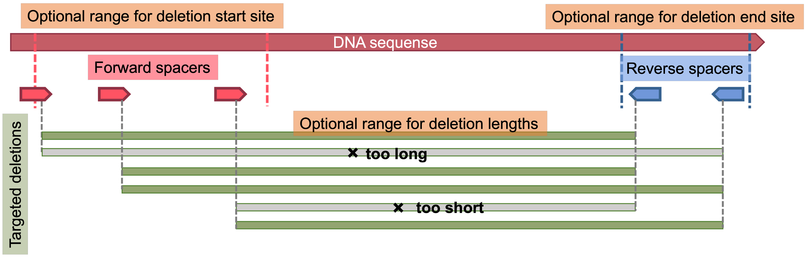

[](https://www.gnu.org/licenses/gpl-3.0)

# PEEP
 
  <br /> <br />

<!-- TABLE OF CONTENTS -->
<h2 id="table-of-contents"> :book: Table of Contents</h2>

<details open="open">
  <summary>Table of Contents</summary>
  <ol>
    <li><a href="#Introduction-"> ➤ Introduction</a></li>
    <li><a href="#Modes-"> ➤ Modes</a></li>
    <ul>
    <li><a href="./markdowns/base.md"> ➤ Usage</a></li>
    </ul>
    <li><a href="#Installation-guide"> ➤ Installation Guide</a></li>
    <li><a href="#References"> ➤ References</a></li>
    <li><a href="#Acknowledgements"> ➤ Acknowledgements</a></li>
  </ol>
</details>


# Introduction <br />

🚨There is a Python API of PEEP and a **web interface** currently under development in collaboration with [Elixir Estonia](https://elixir.ut.ee/). Please wait for further annoucement. 🚨

**Pairs of prime editing (PE) guide RNAs (pegRNAs)** can be used to precisely delete DNA sequences up to 10kbp with the option to insert arbitrary sequences of up to 100bp [(Jump to the details)](<a href="#single-deletion-mode">). <br />
**PEEP** is a pipeline for designing expectedly efficient **_pairs_ of pegRNAs** for such deletions and insertions. Based on your **1) FASTA file** that contains the deletion/insertion target site, **2) reference genome**, and **3) arguments**, it suggests pairs of spacers that are likely to have high on-target activities and low off-target activities based on known scoring methods, designing pegRNA sequences that meet user-defined biological criteria. 

🧬Currently, **supported deletion/insertion methods** are as follows.
1. [**PRIME-Del** (Junhong Choi et al., _Nature Biotechnology_, 2021)](https://www.nature.com/articles/s41587-021-01025-z)
2. [**twinPE** (Andrew V. Anzalone et al., _Nature Biotechnology_, 2021)](https://www.nature.com/articles/s41587-021-01133-w)
<!-- 3. [**GRAND** (Jinlin Wang et al., _Nature Methods_, 2022)](https://www.nature.com/articles/s41592-022-01399-1) --> <br />

📊**Supported scoring methods and biological metrics** include:

**On-target activities**
1. [**DeepPE** (Hui Kwon Kim et al., _Nature Biotechnology_, 2020)](https://www.nature.com/articles/s41587-020-0677-y)
2. [**DeepSpCas9** (Hui Kwon Kim et al., _Science Advances_, 2019)](https://www.science.org/doi/full/10.1126/sciadv.aax9249) 
3. [**CRISPRscan** (Miguel A. Moreno-Mateos et al., _Nature Methods_, 2015)](https://www.ncbi.nlm.nih.gov/pmc/articles/PMC4589495/) 
4. [**RuleSet1**(*deprecated) (John G Doench et al., _Nature Biotechnology_, 2014)](https://doi.org/10.1038/nbt.3026)

**Off-target activities**
1. [**CFD score** (John G Doench et al., _Nature Biotechnology_, 2016)](https://www.ncbi.nlm.nih.gov/pmc/articles/PMC4744125/)
2. [**MIT Specificity score (a.k.a Hsu guide score)** (Patrick D Hsu et al., _Nature Biotechnology_, 2013)](https://pubmed.ncbi.nlm.nih.gov/23873081/)
3. **Off-target sites with 0~4 mismatches within the built-in/provided reference genome**

**Other biological metrics**
1. polyT (4 or more consecutive Ts) within spacers
2. GC contents of spacers, PBSs, and RTTs
3. Melting temperatures
4. RNA minimum free energy

 <br />


# Modes <br />

Currently only single deletion/insertion mode is supported.  <br />
**Please refer to the link below** for the detailed usage.

### **[Single deletion mode](./markdowns/base.md)**　<br>

Finds pairs of spacers within optionally user-defined ranges of deletion start and/or end site, and/or length. Designs PBS and RTT for PRIME-del and twinPE when the corresponding option is given. <br /> <br />
 
  <br /> <br />

What can you do with short to large deletion with the ability to insert short arbitrary sequences? There is a wide variety of possible applications: gene knockout with the reading frame preserved, gene replacement with programmed mutations, integration of a recombinase target site... etc. <br />
But why use paired pegRNAs? Firstly, **a single pegRNA** enables CRISPR- and reverse transcriptase-based precise gene editing by encoding the target site and the desired edit, without causing double strand breaks. Though revolutionary, it is not highly efficient for large deletions (80b~) and insertions (40b~) [(Anzalone et al, 2019)](https://www.nature.com/articles/s41586-019-1711-4). <br />
**Paired pegRNAs**, however, enable larger (~100kb) deletion with insertion of desired (~100b) sequences, expanding the scope of potential applications. Such methods include PRIME-Del [(Choi et al, 2021)](https://www.nature.com/articles/s41587-021-01025-z) and twinPE [(Anzalone et al, 2021)](https://www.nature.com/articles/s41587-021-01133-w). <br />

**But there is a catch**: designing pairs of pegRNAs for desired deletions and insertions requires **a series of cumbersome steps**, including 1)looking for possible spacers in the desired deletion start site and end site, 2) assessing on- and off-target activities across the reference genome using various methods, 3) choosing good spacers within deletion start and end sites, 4) making pairs of spacers with desirable expected deletion and insertion, 5) designing PBS (primer binding site) and RTT (reverse transcription template), 6) and finally assessing on- and off-target activities of pairs and choose the most promising ones. <br />
But you can circumvent all these steps by one-step execution of **PEEP**. <br /> 
For the detailed process and usage, please refere to the documentation for **[Single deletion mode](./markdowns/base.md)**.


# Installation guide <br />

Please [install Java](https://java.com/en/download/help/index_installing.html) if you have not done so.

Next, please download the package: <br />
```
git clone https://github.com/serikitada/PEEP
```

We recommend that you create a conda environment specifically for running PEEP to control versions of packages PEEP depends on.
Please [install conda](https://docs.conda.io/projects/conda/en/latest/user-guide/install/index.html), which is a package, dependency, and environment manager, if you have not done so.
```
conda create --name PEEP python=3.8
conda activate PEEP

conda install numpy=1.22.3
conda install pandas=1.4.1
conda install -c conda-forge pandarallel=1.6.3
conda install -c conda-forge tensorflow=2.4.1
conda install -c conda-forge biopython=1.74
conda install -c bioconda viennarna=2.4.18
```

# Acknowledgements
PEEP owes much of its functionality to the amazing software **FlashFry** created by Dr. Aaron McKenna and members in the Shendure lab. 
<ul>
McKenna, A., Shendure, J. FlashFry: a fast and flexible tool for large-scale CRISPR target design. BMC Biol 16, 74 (2018). https://doi.org/10.1186/s12915-018-0545-0 <br />
Available at: https://github.com/mckennalab/FlashFry <br />
</ul>

Evaluation of **DeepSpCas9** and **DeepPE** scores are enabled thanks to codes and parameters provided by the following papers. 
<ul>
Kim, H.K., Yu, G., Park, J. et al. Predicting the efficiency of prime editing guide RNAs in human cells. Nat Biotechnol 39, 198–206 (2021). https://doi.org/10.1038/s41587-020-0677-y <br />
</ul>
<ul>
Kim, H. K. et al. SpCas9 activity prediction by DeepSpCas9, a deep learning-based model with high generalization performance. Sci Adv 5, eaax9249 (2019) https://www.science.org/doi/10.1126/sciadv.aax9249 <br />
</ul>

We sincerely thank every other software and its creators we depend on to run PEEP.

# References
### Work that provide software and codes used (copied and modified) in PEEP <br />
**FlashFry**: <br />
McKenna, A., Shendure, J. FlashFry: a fast and flexible tool for large-scale CRISPR target design. BMC Biol 16, 74 (2018) <br />
**DeepPE**: <br />
Kim, H.K., Yu, G., Park, J. et al. Predicting the efficiency of prime editing guide RNAs in human cells. Nat Biotechnol 39, 198–206 (2021) <br />
**DeepSpCas9**: <br />
Kim, H. K. et al. SpCas9 activity prediction by DeepSpCas9, a deep learning-based model with high generalization performance. Sci Adv 5, eaax9249 (2019) <br />

### Supported deletion/insertion methods that use paired pegRNAs <br />
**PRIME-Del** : <br />
Choi, J. et al. Precise genomic deletions using paired prime editing. Nat. Biotechnol. 40, 218–226 (2022). <br />
**TwinPE** : <br />
Anzalone, A. V. et al. Programmable deletion, replacement, integration and inversion of large DNA sequences with twin prime editing. Nat. Biotechnol. 40, 731–740 (2021). <br />

### Evaluation metrics used in PEEP <br />
**DeepPE** : <br />
Kim, H. K. et al. Predicting the efficiency of prime editing guide RNAs in human cells. Nat. Biotechnol. 39, 198–206 (2021). <br />
**DeepSpCas9** : <br />
Kim, H. K. et al. SpCas9 activity prediction by DeepSpCas9, a deep learning-based model with high generalization performance. Sci Adv 5, eaax9249 (2019). <br />
**CRISPEscan** : <br />
Moreno-Mateos, M. A. et al. CRISPRscan: designing highly efficient sgRNAs for CRISPR-Cas9 targeting in vivo. Nat. Methods 12, 982–988 (2015). <br />
**RuleSet1** : <br />
Doench, J. G. et al. Rational design of highly active sgRNAs for CRISPR-Cas9-mediated gene inactivation. Nat. Biotechnol. 32, 1262–1267 (2014). <br />
**CFD score** : <br />
Doench, J. G. et al. Optimized sgRNA design to maximize activity and minimize off-target effects of CRISPR-Cas9. Nat. Biotechnol. 34, 184–191 (2016). <br />
**MIT Specificity score** (a.k.a Hsu guide score): <br />
Hsu, P. D. et al. DNA targeting specificity of RNA-guided Cas9 nucleases. Nat. Biotechnol. 31, 827–832 (2013). <br />
