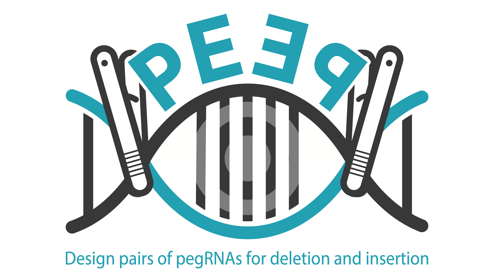

# PEEP
 
  <br /> <br />

**PEEP** is a pipeline for designing plausibly efficient **_pairs_ of pegRNAs** for deletions and insertions, estimating editing efficiencies based on various metrics. <br />
Currently, supported deletion/insertion methods are as follows.
1. [**PRIME-Del** (Junhong Choi et al., _Nature Biotechnology_, 2021)](https://www.nature.com/articles/s41587-021-01025-z)
2. [**twinPE** (Andrew V. Anzalone et al., _Nature Biotechnology_, 2021)](https://www.nature.com/articles/s41587-021-01133-w)
3. [**GRAND** (Jinlin Wang et al., _Nature Methods_, 2022)](https://www.nature.com/articles/s41592-022-01399-1) <br />

Supported metrics include:
1. DeepPE
2. ...
3. 

 <br />


<!-- TABLE OF CONTENTS -->
<h2 id="table-of-contents"> :book: Table of Contents</h2>

<details open="open">
  <summary>Table of Contents</summary>
  <ol>
    <li><a href="#about-the-project"> ➤ About The Project</a></li>
    <li><a href="#overview"> ➤ Overview</a></li>
    <li><a href="#project-files-description"> ➤ Project Files Description</a></li>
    <li><a href="#getting-started"> ➤ Getting Started</a></li>
    <li><a href="#scenario1"> ➤ Scenario 1: Depth First Search </a></li>
    <li><a href="#scenario2"> ➤ Scenario 2: Breadth First Search </a></li>
    <li><a href="#scenario3"> ➤ Scenario 3: Uniform Cost Search </a></li>
    <li><a href="#scenario4"> ➤ Scenario 4: A* search algorithm </a></li>
    <li><a href="#scenario5"> ➤ Scenario 5: Finding All Corners </a></li>
    <li><a href="#scenario6"> ➤ Scenario 6: Admissible and Consistent Heuristic </a></li>
    <li><a href="#scenario7"> ➤ Scenario 7: Eating All Dots </a></li>
    <li><a href="#scenario8"> ➤ Scenario 8: Suboptimal Search </a></li>
    <li><a href="#references"> ➤ References</a></li>
    <li><a href="#credits"> ➤ Credits</a></li>
  </ol>
</details>


[Modes](#Modes)
[Installation guide](#Installation-guide)


## Modes <br />

Please refer to each link for usage and details.

### **[Single deletion mode](./markdowns/base.md)**　<br>

Finds pairs of spacers within optionally user-defined ranges of deletion start and/or end site, and/or length. Designs PBS and RTT for PRIME-del and TwinPE when the option is given. <br /> <br />
 
  <br /> <br />

### **[Extend mode for varying lengths of deletions](./markdowns/vextend.md)**　<br>

Finds the possible forward/reverse spacers in a range fixed by the user, selects the best one either automatically or manually specified by the user, and searches for reverse/forward spacers recursively extending the deletion lengths by user-defined steps.  <br /> <br />
  
 <br />  <br />

### **[Tiling mode for disperse deletions of the same length](./markdowns/sparse.md)**　<br>

**sparse.py** : sparse mode for achieving the same length of deletions but with a certain sparcity (no overlap of different deletions, or some overlap)  <br />
 <br />

<br />

#
## Installation guide <br />
**System requirements** <br />

**Environmental setting**

Please [install Java](https://java.com/en/download/help/index_installing.html) if you have not done so.

We recommend that you create a conda environment specifically for running SoftwareName to control versions of packages SoftwareName depends on.
Please [install conda](https://docs.conda.io/projects/conda/en/latest/user-guide/install/index.html) if you have not done so.
```
conda create --name py3.8 python=3.8
conda activate py3.8

#for any module
conda install numpy 
conda install pandas
conda install matplotlib

#for DeepPE metric
conda install -c conda-forge tensorflow
conda install -c conda-forge biopython=1.74
conda install -c bioconda viennarna
conda install pyexcel 
```
