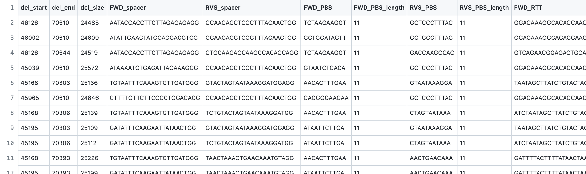
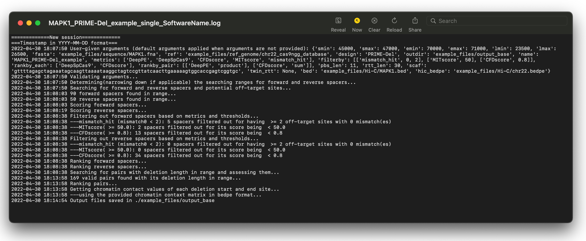

# Single deletion mode　<br>

Designs pairs of pegRNAs for a single deletion and ranks them by estimated editing efficiency by assessing various metrics. Ranges for deletion start site, end site, and length can optionally be user-defined. 
<br /> <br />
 
<br /> <br />

# 📖 Table of contents
- [Usage guide](#-usage-guide)
  - [Usage](#usage)
    - [1. PRIME-Del usage](#1prime-del-usage)
    - [2. twin-PE usage](#2twinpe-usage)
  - [Arguments](#arguments)
    - [Required arguments](#required-arguments)
    - [Optional arguments](#optional-arguments)
- [Examples](#-example-usage)
  - [Example input files](#example-input-files-)
  - [1. PRIME-Del example](#1prime-del-example)
    - [PRIME-Del example command](#prime-del-example-command)
    - [PRIME-Del example output](#prime-del-example-output)
  - [2. twinPE example](#2twinpe-example)
    - [twinPE example command](#twinpe-example-command)
    - [twinPE example output](#twinpe-example-output)


# 📕 Usage guide
For details of each argument, please refer to [Arguments section](#Arguments) <br>
For examples, please refer to [Examples section](#Examples).
## Usage
## 1.PRIME-Del usage
Arguments followed by <code><></code> below indicate that they are required. <br>
Arguments followed by <code>[]</code> below indicate that they are optional. <br>
Contents within <code>{}</code> below denotes parameters or default behaviours.

```bash
python base.py \
    --fasta <FASTA file> \
    --ref_genome <pre-processed reference genome file> \
    --design PRIME-Del \
    --outname [output file name] {fasta name + design method} \
    --outdir [output directory] {outname + "_SoftwareName_out"} \
    --start_min [minimum deletion start position] \
    --start_max [maximum deletion end position] \
    --end_min [minimum deletion end position] \
    --end_max [maximum deletion end position] \
    --length_min [minimum deletion length] \
    --length_max [maximum deletion length] \
    --metrics [metrics to show in the output] {"DeepPE","DeepSpCas9","CFDscore","MITscore","mismatch_hit"} \
    --filter_by [metrics and thresholds to filter spacers by]  {[["mismatch_hit",0,2],["MITscore",50],["CFDscore",0.8]]} \
    --rankby_each [metrics to rank each forward/reverse spacer by] {"DeepSpCas9","CFDscore"} \
    --rankby_pair [metrics to rank pairs of pegRNAs/spacers by] {[["DeepPE","product"],["CFDscore","sum"]]} \
    --pbs_len [PBS length] {11} \
    --rtt_len [RTT length] {30} \
    --scaffold [Scaffold for PE2] {"gttttagagctagaaatagcaagttaaaataaggctagtccgttatcaacttgaaaaagtggcaccgagtcggtgc"}
```
❓How to show default behavious

## 2.twinPE usage
Arguments followed by <code><></code> below indicate that they are required. <br>
Arguments followed by <code>[]</code> below indicate that they are optional. <br>
Contents within <code>{}</code> below denotes parameters or default behaviours.

```bash
python base.py \
    --fasta <FASTA file> \
    --ref_genome <pre-processed reference genome file> \
    --design twinPE \
    --outname [output file name] {fasta name + design method} \
    --outdir [output directory] {outname + "_SoftwareName_out"} \
    --start_min [minimum deletion start position] \
    --start_max [maximum deletion end position] \
    --end_min [minimum deletion end position] \
    --end_max [maximum deletion end position] \
    --length_min [minimum deletion length] \
    --length_max [maximum deletion length] \
    --metrics [metrics to show in the output] {"DeepPE","DeepSpCas9","CFDscore","MITscore","mismatch_hit"} \
    --filter_by [metrics and thresholds to filter spacers by]  {[["mismatch_hit",0,2],["MITscore",50],["CFDscore",0.8]]} \
    --rankby_each [metrics to rank each forward/reverse spacer by] {"DeepPE","CFDscore"} \
    --rankby_pair [metrics to rank pairs of pegRNAs/spacers by] {[["DeepPE","product"],["CFDscore","sum"]]} \
    --pbs_len [PBS length] {11} \
    --twinPE_rtt [RTT sequence] {None} \
    --scaffold [Scaffold for PE2] {"gttttagagctagaaatagcaagttaaaataaggctagtccgttatcaacttgaaaaagtggcaccgagtcggtgc"}
```
❓How to show default behavious <br>

## Arguments
## Required arguments 
🔷 **<code>--fasta</code> or <code>-f</code>** : The path to the input file in FASTA format, that contains the sequence within which deletion is to be induced [(the example FASTA file)](./../example_files/sequence/MAPK1.fna).   <br>
🔷 **<code>--ref_genome</code> or <code>-ref</code>** : The path to the reference genome file for evaluating off-target activity [(the example reference genome file and its header file)](./../example_files/ref_genome). Users can either  
- provide their own file that needs to be pre-processed (for details, refer to [ref_genome.md](./ref_genome.md)) <br>
- choose human genome ([hg38.p14](https://www.ncbi.nlm.nih.gov/assembly/GCA_000001405.29)) or mouse genome ([mm39](https://www.ncbi.nlm.nih.gov/assembly/GCF_000001635.27/)) from SoftwareName's built-in library <br>

🔷　**<code>--design</code> or <code>-design</code>** : The deletion method to design PBS and RTT accordingly. Should either be "PRIME-Del" or "twinPE". <br>  <br>
**+ when <code>--design</code> is "twinPE"** <br>
🔷　**<code>--twinPE_rtt</code> or <code>-twin_rtt</code>** : The reverse transcription template for twinPE.  <br>

## Optional arguments
**Output file name and directory** <br>
🔷 **<code>--outname</code> or <code>-name</code>** : Name of the output files except filename extensions. When not provided, output filenames will automatically be the name of FASTA file combined with the deletion method. (When FASTA file is named "MAPK1.fna" and the method is "twinPE", file names will be "MAPK1_twinPE" followed by extensions.)  <br>
🔷 **<code>--outdir</code> or <code>-o</code>** : Path to the output directory. If the given directory already exists, output files will be saved there. If it does not exist, it will be made. When not provided, output directory will automatically be the same as <code>--outname</code>. <br>

**Deletion start site range**  <br>
🔷 **<code>--start_min</code> or <code>-smin</code>** : Minimum starting position of the deletion, index starting from 1.  <br>
🔷 **<code>--start_max</code> or <code>-smax</code>** : Maximum starting position of the deletion, index starting from 1.  <br>
※Passing either argument is fine as well as passing both arguments.　 <br>

**Deletion end site range**  <br>
🔷 **<code>--end_min</code> or <code>-emin</code>** : Minimum ending position of the deletion, index starting from 1.  <br>
🔷 **<code>--end_max</code> or <code>-emax</code>** : Maximum ending position of the deletion, index starting from 1.  <br>
※Passing either argument is fine as well as passing both arguments.　 <br>

**Deletion length range**  <br>
🔷 **<code>--length_min</code> or <code>-lmin</code>** : Minimum length of the deletion. <br> 
🔷 **<code>--length_max</code> or <code>-lmax</code>** : Maximum length of the deletion. <br> 
※Passing either argument is fine as well as passing both arguments.　 <br>

**Metrics-related arguments**  <br>
For details of each metric, refer to [this page](./metrics.md).  <br>
🔷 **<code>--metrics</code> or <code>-m</code>** : Metrics to be shown in the output. In addition to these metrics, metrics chosen in the following arguments will also be shown in the output. By default, <code>DeepPE</code>,<code>DeepSpCas9</code>,<code>MITscore</code>,<code>CFDscore</code>,and <code>mismatch_hit</code>. <br>
Please choose from <br>
**on-target activity metrics**: <code>DeepPE</code> (cannot be chosen with PRIME-Del),<code>DeepSpCas9</code>,<code>CRISPRscan</code>,<code>RuleSet1</code> <br>
**off-target activity metrics:** <code>MITscore</code>,<code>CFDscore</code>,and <code>mismatch_hit</code>. <br>


🔷 **<code>--filter_by</code> or <code>-filter</code>** : Metric and its corresponding threshold to use for filtering out bad spacers. By default=[<code>["hit_mismatch",0,2]</code>,<code>["MIT",50]]</code>.  <br>
| Metric  | Possible values | Higher value indicates | Notes |  
|  :---:   |  :---:   | :---:   |  :---:   |
| <code>DeepPE</code>  | - | better (higher on-target activity) | cannot be chosen with PRIME-Del |  
| <code>DeepSpCas9</code>  | - | better (higher on-target activity) | - |
| <code>CRISPRscan</code>  | 0-1 | better (higher on-target activity) | - |
| <code>RuleSet1</code>  | 0-1 | better (higher on-target activity) | - |
| <code>MITscore</code>  | 0-100 | better (lower off-target activity) | cutoff value of 50 is recommended by [this paper](http://genomebiology.biomedcentral.com/articles/10.1186/s13059-016-1012-2) |
| <code>CFDscore</code>  | 0-1 | better (lower off-target activity) | - |
| <code>mismatch_hit</code>  | 0- | worse (more off-target sites) | [<code>mismatch_hit</code>, mismatch, hit_threshold] - see notes below |
- Except <code>mismatch_hit</code>, usage is <code>[metric, threshold]</code>, and spacers that have each metric below (**<**) the threshold will be discarded (i.e. **spacers with each metric ≧ threshold will be kept** and proceeded into pairing).
- For <code>mismatch_hit</code>, usage is <code>[mismatch_hit, mismatch_number, hit_threshold]</code>. Mismatch number can be chosen from 0,1,2,3 and 4, and the <code>hit_threshold</code> can be 1 and higher. Spacers that have off-target sites as many as or more than (**≧**) <code>hit_threshold</code> will be removed(i.e. **spacers with (the number of off-target sites) < <code>hit_threshold</code> will be kept** and proceeded into pairing). <br>

🔷 **<code>--rankby_each</code> or <code>-erankby</code>** : Metric to use for ranking forward and reverse spacers.  By default, <code>DeepSpCas9</code> is chosen for PRIME-Del and <code>DeepPE</code> for twinPE. <br>
Please choose from: <br>
**on-target activity metrics**: <code>DeepPE</code> (cannot be chosen with PRIME-Del),<code>DeepSpCas9</code>,<code>CRISPRscan</code>,<code>RuleSet1</code> <br>
**off-target activity metrics:** <code>MITscore</code> and <code>CFDscore</code>. <br>

🔷 **<code>--rankby_pair</code> or <code>-prankby</code>** : Metric to use for ranking pairs of pegRNAs (spacers) and a pair-wise scoring method (usage: [<code>metric</code>, <code>pair-wise scoring method</code>]). By default, [<code>["DeepPE", "product"]</code>,<code>["CFD","sum"]</code>] is employed.  <br>
For metric, please choose from: <br>
**on-target activity metrics**: <code>DeepPE</code>,<code>DeepSpCas9</code>,<code>CRISPRscan</code>,<code>RuleSet1</code> <br>
**off-target activity metrics:** <code>MITscore</code> and <code>CFDscore</code>. <br>
For pair-wise scoring, please choose from: <br>
- <code>sum</code> : summation of 2 scores
- <code>product</code> : product of 2 scores
- <code>min</code> : minimum value of 2 scores

**PBS, RTT, and prime editor related arguments**  <br>
🔷 **<code>--pbs_len</code> or <code>-pbsl</code>** : PBS length. 11 by default. <br>
🔷 **<code>--scaffold</code> or <code>-scaf</code>** : Prime Editor 2 (PE2) scaffold sequence. This is used for <code>DeepPE</code> calculation. By default, gttttagagctagaaatagcaagttaaaataaggctagtccgttatcaacttgaaaaagtggcaccgagtcggtgc. <br>
🔷 **<code>--rtt_len</code> or <code>-rttl</code>** :  RTT length. 30 by default. Only applicable when PRIME-Del is chosen. <br>
🔷 **<code>--twinPE_rtt</code> or <code>-twin_rtt</code>** : The reverse transcription template for twinPE. Only applicable when twinPE is chosen. <br>


# 📘 Example Usage
## Example input files <br>
[The example FASTA file](./../example_files/sequence/MAPK1.fna)  <br>
[The example reference genome file and its header file](./../example_files/ref_genome)  <br>
[The example bed file](./../example_files/Hi-C/MAPK1.bed)  <br>
[The example chromatin contact matrix in bedpe format](https://drive.google.com/drive/folders/13gRzckg7S5KKhiy3LE2FfX4PQJ84IVet?usp=sharing)  <br>


## 1.PRIME-Del example
### PRIME-Del example command
```bash
python base.py \
    --fasta example_files/sequence/MAPK1.fna \
    --ref_genome example_files/ref_genome/chr22_cas9ngg_database \
    --design PRIME-Del \
    --outdir example_files/output_base \
    --outname MAPK1_PRIME-Del_example \
    --start_min 45000 \
    --start_max 47000 \
    --end_min 70000 \
    --end_max 71000 \
    --length_min 23500 \
    --length_max 26500 \
    --metrics DeepPE DeepSpCas9 CFDscore MITscore mismatch_hit \
    --filter_by '[["mismatch_hit",0,2],["MITscore",50],["CFDscore",0.8]]' \
    --rankby_each DeepSpCas9 CFDscore \
    --rankby_pair '[["DeepPE","product"],["CFDscore","sum"]]' \
    --pbs_len 11 \
    --rtt_len 30
```

### PRIME-Del example output
**1. CSV file** <br />
[Go to the CSV file](../example_files/output_base/MAPK1_PRIME-Del_example_single_SoftwareName.csv)
  
 ...
<br /> 

**2. Log file** <br />
[Go to the log file](../example_files/output_base/MAPK1_PRIME-Del_example_single_SoftwareName.log)
 
<br /> 


## 2.TwinPE example
### twinPE example command

```bash
python base.py \
    --fasta example_files/sequence/MAPK1.fna \
    --ref_genome example_files/ref_genome/chr22_cas9ngg_database \
    --design twinPE \
    --outdir example_files/output_base \
    --start_min 45000 \
    --start_max 47000 \
    --end_min 70000 \
    --end_max 71000 \
    --length_min 23500 \
    --length_max 26500 \
    --metrics DeepPE DeepSpCas9 CFDscore MITscore mismatch_hit \
    --filter_by '[["mismatch_hit",0,2],["MITscore",50],["CFDscore",0.8]]' \
    --rankby_each DeepPE CFDscore \
    --rankby_pair '[["DeepPE","product"],["CFDscore","sum"]]' \
    --pbs_len 11 \
    --twinPE_rtt ATAACTTCGTATAATGTATGCTATACGAAGTTATGGGAT
```
### twinPE example output
**1. CSV file** <br />
[Go to the CSV file](../example_files/output_base/MAPK1_twinPE_single_SoftwareName.csv)
  
 ...
  ❓ The link above directs to the actual output with twinPE, but the image is from the Prime-del example. The image will be updated once the example is fixed.
<br /> 

**2. Log file** <br />
[Go to the log file](../example_files/output_base/MAPK1_twinPE_single_SoftwareName.log)
 
 ❓ The link above directs to the actual output with twinPE, but the image is from the Prime-del example. The image will be updated once the example is fixed.
<br /> 

❓ Explain flags in the output but where?
